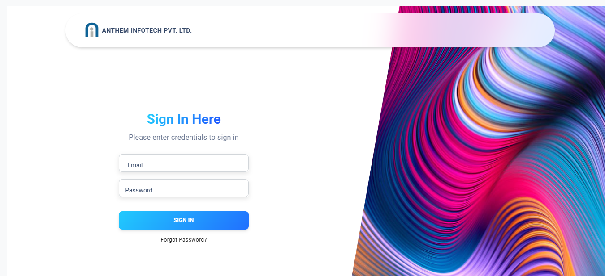
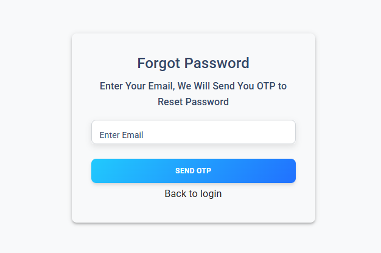
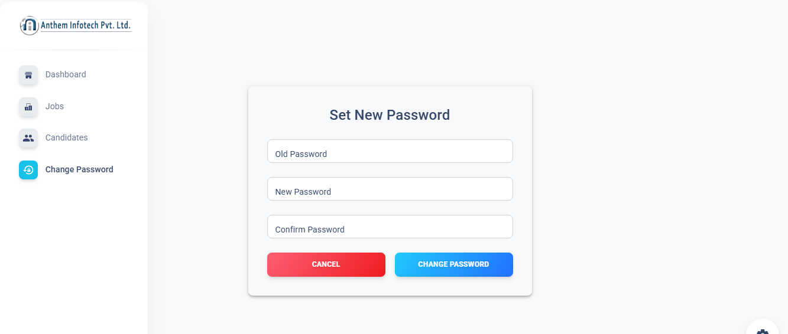
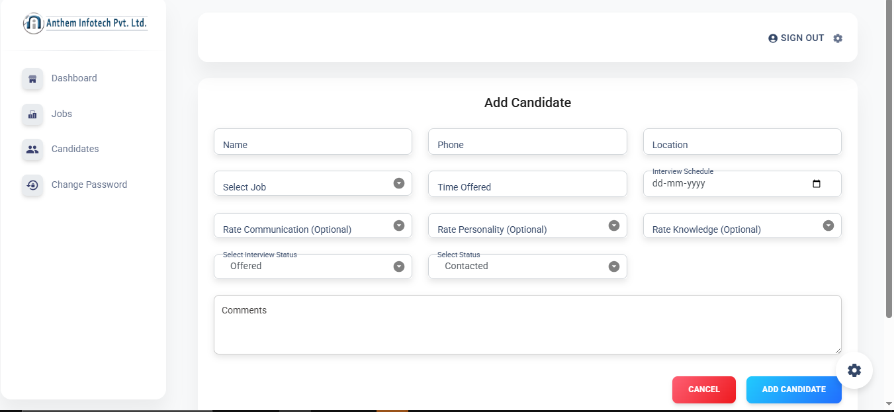
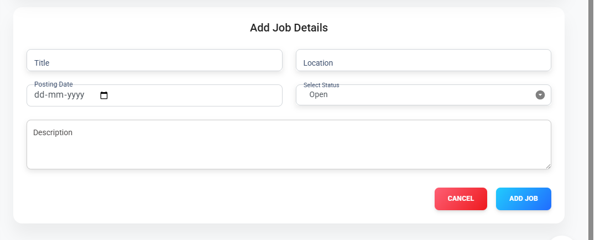

# 🧑‍💼 Recruitment Hub

**Recruitment Hub** is a personal company-level recruitment management system designed for owners or managers to efficiently track, manage, and analyze candidate and job-related data. The system streamlines the recruitment process by providing tools for candidate scheduling, job tracking, and insightful analytics — all within a secure and user-friendly interface.

---

## 🔧 Tech Stack

### Frontend:
- React.js  
- Material UI (MUI)

### Backend:
- Node.js  
- MongoDB

---

## 🚀 Features

- 🔐 **Authentication System**:  
  - Secure login and registration  
  - Forgot, reset, and change password functionality  

- 👥 **Candidate Management**:  
  - Add, update, delete candidate information  
  - Assign interview slots and job details  
  - View and filter candidates by job role, status, and more  
  - Paginated candidate listings for easy navigation  

- 💼 **Job Management**:  
  - Create, edit, delete job postings  
  - View open/closed job stats  
  - Job search and filtering  
  - Pagination for job listings  

- 📊 **Dashboard Insights**:  
  - Visual graphs and statistics  
  - View:
    - Total Candidates  
    - Scheduled Interviews  
    - Total Jobs  
    - Open Jobs  

- 🔍 **Advanced Filtering & Searching**:  
  - Filter by name, role, date, and job  
  - Search candidates and jobs using multiple criteria  

- ✅ **CRUD Operations**:  
  - Full Create, Read, Update, Delete functionality for both Jobs and Candidates

---

## 📂 Project Structure

Install dependencies:
# Frontend
cd Frontend
npm install
npm start 

# Backend
cd Backend
npm install
npm start

🔧 Tech Stack
🖥️ Frontend
React.js – Modern JavaScript library for building user interfaces

Material UI (MUI) – Component-based UI library for faster and consistent design

Axios – For making HTTP requests to the backend

⚙️ Backend
Node.js – JavaScript runtime for server-side logic

Express.js – Minimal and flexible Node.js web framework

🗄️ Database
MongoDB – NoSQL database for storing candidates, jobs, and user data

🔐 Authentication & Security
JWT (JSON Web Tokens) – For secure authentication and authorization

bcrypt.js – For hashing passwords

📊 Other Features & Tools
Mongoose – MongoDB object modeling for Node.js

Chart.js / Recharts (optional) – For graphical dashboard insights

dotenv – Environment variable management

